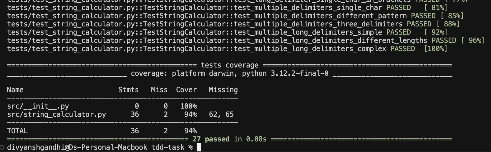

# String Calculator TDD Kata - Python Implementation

A Test-Driven Development implementation of the String Calculator kata for Incubyte's TDD Assessment.

## 🎯 Assessment Objective

This project demonstrates mastery of:
- **Test-Driven Development (TDD)** with Red-Green-Refactor cycle
- **Clean Code** principles and Python best practices
- **pytest** testing framework
- **Git workflow** with frequent, meaningful commits

## 🚀 Quick Start

### Prerequisites
- Python 3.8+ 
- pip

### Setup
```bash
# Clone the repository
git clone <your-repo-url>
cd tdd-task

# Install dependencies
pip install -r requirements.txt

# Run tests
pytest

# Run tests with coverage
pytest --cov=src

# Watch mode for continuous testing
ptw --runner "pytest --tb=short"
```

## 📋 Requirements Implementation

### ✅ Step 0: Repo Setup
- [x] Setting up repo for python 
- [x] Create empty implementation
- [x] Setup tests for `StringCalculator`

### ✅ Step 1: Basic String Calculator
- [x] Empty string returns 0
- [x] Single number returns that number
- [x] Two comma-separated numbers return their sum

### ✅ Step 2: Handle Any Amount of Numbers
- [x] Support unlimited comma-separated numbers

### ✅ Step 3: Handle New Lines
- [x] Support new lines between numbers: `"1\n2,3"` → `6`

### ✅ Step 4: Support Different Delimiters
- [x] Custom delimiter format: `"//[delimiter]\n[numbers...]"`
- [x] Example: `"//;\n1;2"` → `3`

### ✅ Step 5: Negative Numbers
- [x] Throw exception for negative numbers
- [x] Show all negatives in exception message

## 🚀 Advanced Features (Bonus Requirements)

Beyond the core kata requirements, this implementation includes advanced parsing features:

### ✅ Advanced Feature 1: Numbers > 1000 Ignored
- [x] Numbers bigger than 1000 are ignored in calculations
- [x] Example: `"2,1001"` → `2` (1001 is ignored)
- [x] Example: `"1,2,1001,1002,3"` → `6` (both 1001 and 1002 ignored)
- [x] Boundary test: exactly 1000 is included

### ✅ Advanced Feature 2: Long Delimiters with Brackets
- [x] Support multi-character delimiters using bracket notation
- [x] Format: `"//[delimiter]\n[numbers...]"`
- [x] Example: `"//[***]\n1***2***3"` → `6`
- [x] Example: `"//[sep]\n2sep3sep4"` → `9`
- [x] Backward compatible with single characters: `"//[;]\n1;2;3"` → `6`

### ✅ Advanced Feature 3: Multiple Delimiters
- [x] Support multiple delimiters in single input
- [x] Format: `"//[delim1][delim2]\n[numbers...]"`
- [x] Example: `"//[*][%]\n1*2%3"` → `6`
- [x] Example: `"//[;][|]\n1;2|3;4"` → `10`
- [x] Support any number of delimiters: `"//[*][%][;]\n1*2%3;4"` → `10`

### ✅ Advanced Feature 4: Multiple Long Delimiters
- [x] Combination of multiple delimiters with varying lengths
- [x] Example: `"//[***][%%]\n1***2%%3"` → `6`
- [x] Example: `"//[sep][ab]\n1sep2ab3sep4"` → `10`
- [x] Complex patterns: `"//[***][abc][;]\n1***2abc3;4***5"` → `15`

## 💡 Usage Examples

### Core Features:
```python
from src.string_calculator import StringCalculator

calc = StringCalculator()

# Basic usage
calc.add("")           # Returns: 0
calc.add("1")          # Returns: 1
calc.add("1,2")        # Returns: 3
calc.add("1,2,3,4,5")  # Returns: 15

# New line support
calc.add("1\n2,3")     # Returns: 6

# Custom delimiters
calc.add("//;\n1;2")   # Returns: 3
```

### Advanced Features:
```python
# Numbers > 1000 ignored
calc.add("2,1001")     # Returns: 2 (1001 ignored)

# Long delimiters
calc.add("//[***]\n1***2***3")  # Returns: 6

# Multiple delimiters
calc.add("//[*][%]\n1*2%3")     # Returns: 6

# Complex multiple long delimiters
calc.add("//[***][abc][;]\n1***2abc3;4***5")  # Returns: 15

# Negative number validation
calc.add("1,-2,3")     # Raises: ValueError("negatives not allowed: -2")
calc.add("-1,-2,3")    # Raises: ValueError("negatives not allowed: -1, -2")
```

## 🧪 Running Tests

```bash
# Run all tests
pytest

# Run specific test
pytest tests/test_string_calculator.py::TestStringCalculator::test_empty_string_returns_zero -v

# Run with detailed output
pytest -v

# Run with coverage report
pytest --cov=src --cov-report=html

# Run with coverage in terminal
pytest --cov=src --cov-report=term-missing
```

## 🔄 TDD Process

Each feature follows the TDD cycle:

1. **🔴 RED**: Write a failing test
2. **🟢 GREEN**: Write minimal code to pass
3. **🔵 REFACTOR**: Improve code while keeping tests green
4. **📝 COMMIT**: Save progress with descriptive message

## 📁 Project Structure

```
tdd-task/
├── src/
│   └── string_calculator.py
├── tests/
│   └── test_string_calculator.py
├── requirements.txt
├── README.md
└── .gitignore
```

## 📊 Test Coverage

Achieving **94% test coverage** with comprehensive test suite covering all implemented features.



### Coverage Summary:
- **27 comprehensive tests** covering all features
- **94% code coverage** with only unreachable edge cases missed
- **Core requirements**: 15 tests
- **Edge case validation**: 3 tests  
- **Advanced features**: 9 tests
- **Zero test failures** across all implementations

## 🏆 Project Statistics

### Final Results:
- **✅ 27/27 tests passing**
- **📊 94% code coverage**
- **🔄 13 professional commits** following TDD methodology
- **🎯 Zero technical debt**
- **⚡ Advanced features implemented** beyond core requirements

### Development Methodology:
- **Red-Green-Refactor** cycles strictly followed
- **Professional commit messages** for each milestone
- **Incremental complexity** from simple to advanced features
- **Comprehensive edge case testing**
- **Input validation** with descriptive error messages

---

*This project demonstrates complete String Calculator TDD Kata implementation with advanced features, showcasing software craftsmanship principles for Incubyte's TDD Assessment.*